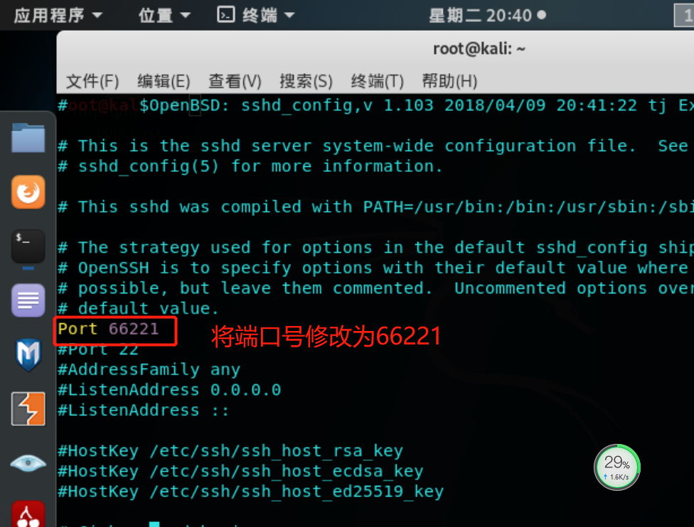
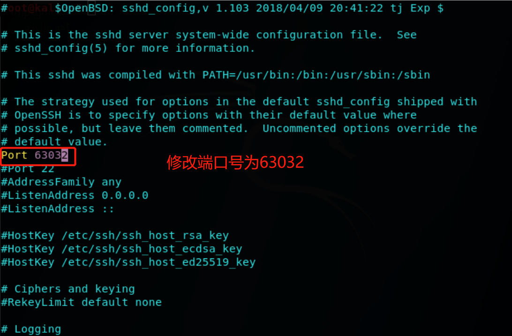
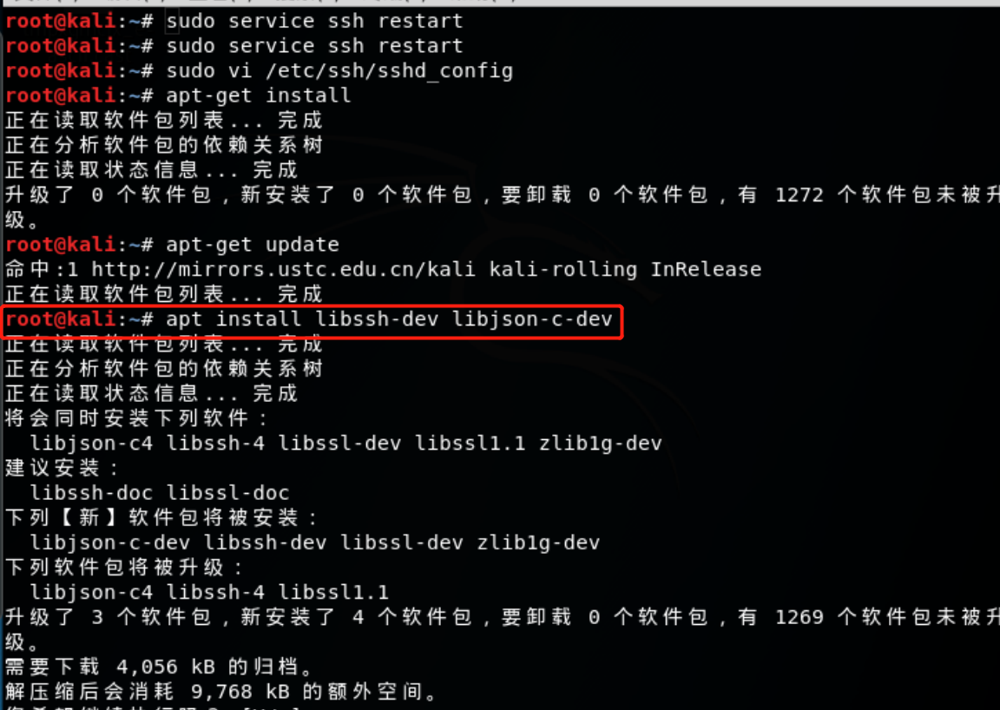
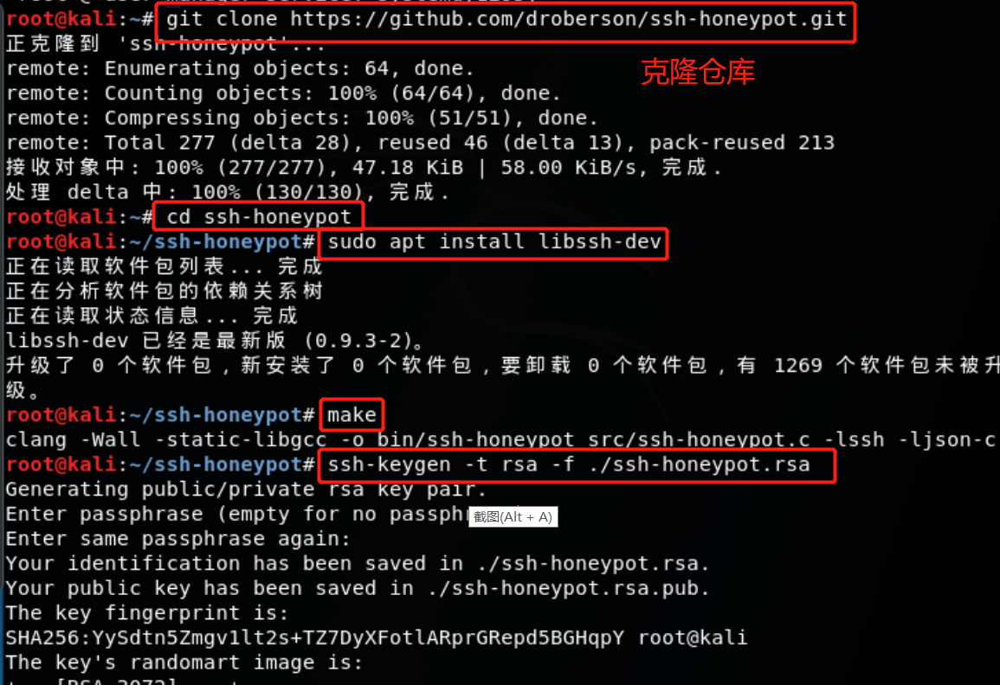
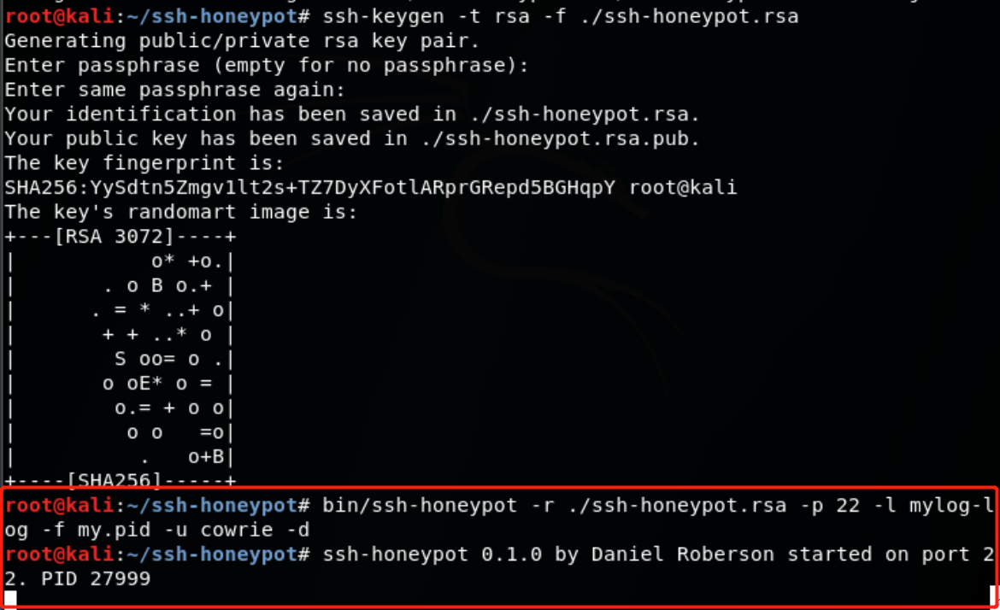
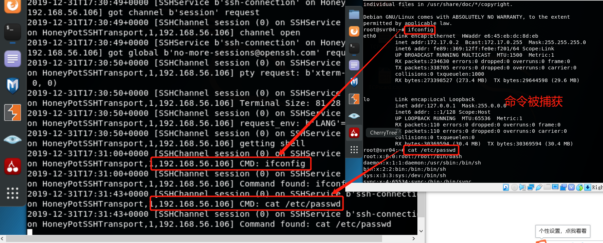
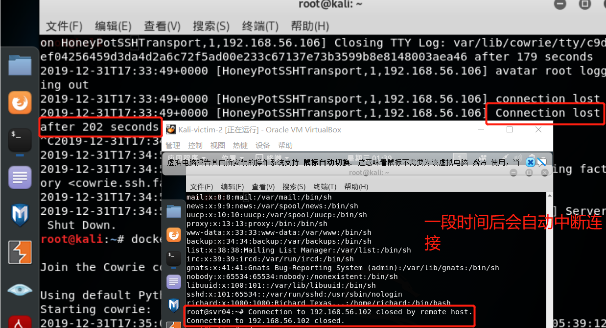

# 常见蜜罐体验和探索

## 实验目的

- 了解蜜罐的分类和基本原理
- 了解不同类型蜜罐的适用场合
- 掌握常见蜜罐的搭建和使用

## 实验环境

- 从paralax/awesome-honeypots中选择 1 种低交互蜜罐和 1 种中等交互蜜罐进行搭建实验
  - 推荐 `SSH` 蜜罐

## 实验要求

- [x] 记录蜜罐的详细搭建过程；

- [x] 使用 `nmap` 扫描搭建好的蜜罐并分析扫描结果，同时分析「 `nmap` 扫描期间」蜜罐上记录得到的信息；

- [x] 如何辨别当前目标是一个「蜜罐」？以自己搭建的蜜罐为例进行说明；

- [x] （可选）总结常见的蜜罐识别和检测方法；

- （可选）基于 [canarytokens](https://github.com/thinkst/canarytokens) 搭建蜜信实验环境进行自由探索型实验；

## 实验过程

#### SSH蜜罐

* 两台虚拟机的ip地址

  

  
  
* 环境搭建

  * 对目标主机使用以下命令修改端口号

    ```
    sudo vi /etc/ssh/sshd_config
    ```

    将端口号改为66221，保存并退出

    

  * 重启SSH

    发现重启SSH失败，尝试再次更改端口号为63032，重启SSH成功

    

    

  * 安装libssh和libjson-c-dev

    

  * 下载并安装蜜罐，这里用SSH蜜罐

    

    

* SSH蜜罐实验

  * 目标主机开启22端口监听
  
    ```
    bin/ssh-honeypot -p 22
    ```
  
    
  
  * 攻击者主机远程登录目标主机
  
    ```
    ssh root@192.168.56.103
    ```
  
    
  
    可以看到在目标主机这边可以看到攻击者主机的ip地址及 尝试输入的password
  
    
  
  * 进行nmap扫描，发现目标主机这边什么都捕获不到
  
    

#### cowrie蜜罐实验

* 环境搭建

  * 安装并启动docker

    ```
    apt-get install docker docker-compose
    service docker start
    ```

  * 启动cowrie蜜罐

    ```
    docker pull cowrie/cowrie
    docker run -p 2222:2222 cowrie/cowrie 
    ```

    

  * 攻击者主机远程登录目标主机

    ```
    ssh root@192.168.56.102 -p 2222
    ```

  * 执行一些终端命令，这里执行了 `ifconfig` 和 `cat /etc/passwd` 命令，可以看到在目标主机终端中看到了来自攻击者主机的终端命令

    

  * nmap端口扫描，目标主机没有捕获到

    

## 实验总结

* cowrie无论什么口令都可以登录，而且攻击者能够查看到一些想要看的信息。记录下来的信息相比ssh蜜罐要更完备一些，可以看到攻击者登录后具体做了哪些操作

* 有时间限制，超过一定时间会自动断开，如果不是蜜罐，不会出现这种情况

  

  

* 常见的蜜罐识别及检测方法
  * 对低交互性蜜罐系统的识别，主要集中在模拟技术的检测上，这种蜜罐只允许入侵者做很少的交互，配置简单，易用，但存在较为明显的特征或指纹，易被识破，如黏着蜜罐对发向该计算机的请求有意地延缓回答，耗费攻击者的系统资源，但非常容易被检测，只要具有一些网络工程经验就可以判断出目标系统的真伪。比如在OSI/ISO参考模型第七层，仅仅需要看服务的延迟，攻击者就可以在多次尝试后发现目标系统是假系统，对于第四层，若TCP窗口减小为0并且继续接收新的数据包，这种现象会提醒攻击者可能是蜜罐。
  * 对高交互性蜜罐系统的检测、识别工具虽然非常有效，但检测思路主要集中在某一特定蜜罐组件或蜜罐隐藏技术上，检测思路单一，存在较大局限性，易漏报或误报，并无法检测未知的蜜罐系统，如虚拟机探测技术，检查当前代码是否运行在一台虚拟机上，虽然不一定是蜜罐，但足以引起警觉。

## 实验参考

* 课程视频和教程

* https://www.docin.com/p-1517346225.html	"基于蜜罐特征的蜜罐识别技术"

  
